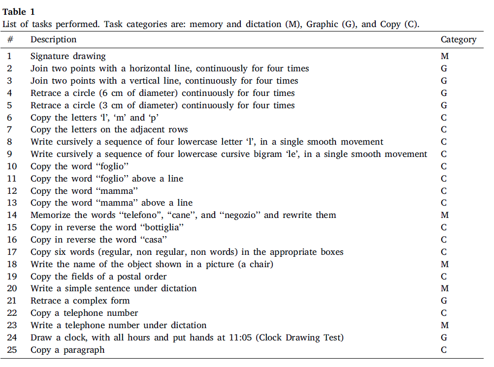
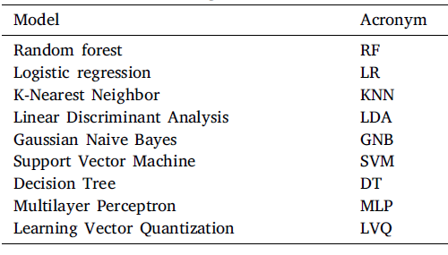
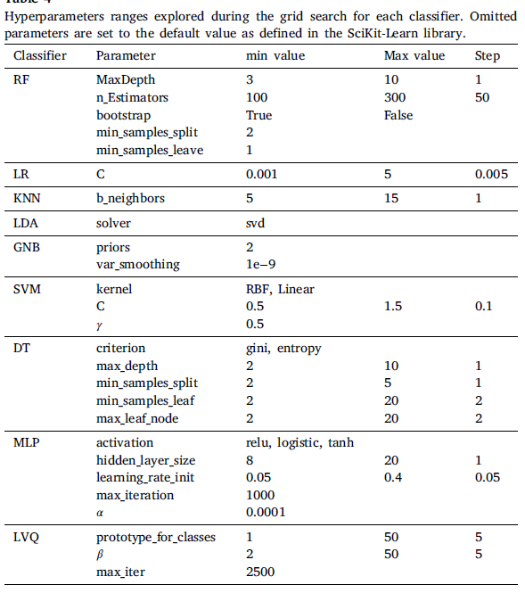
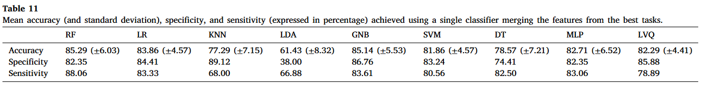

# Diagnosing Alzheimer’s disease from on-line handwriting: a novel dataset and performance benchmarking

The DARWIN dataset contains handwriting data collected composed of 25 handwriting tasks. The protocol  was specifically designed for the **early** detection of Alzheimer’s disease (AD). The dataset includes data from 174 participants (89 AD patients and 85 healthy people).

The file consists of **452 columns**. The first column shows participants' identifiers, whereas the last column shows the class to which each participant belongs.  This value can be equal to  'P' (Patient) or 'H' (Healthy).
The tasks performed are 25, and for each task 18 features have been extracted.

By recording the motor dynamics of 174 participants across 25 specific tasks, the authors provide a robust foundation for identifying neurodegenerative signs through non-invasive means. 
Results demonstrate that multiclassifier systems effectively capture the complexity of the disease, achieving high diagnostic accuracy.






---

## Experiment 1

The script checks the following classification algorithms:
 - Random forest (RF)
 - Logistic Regression (LR)
 - k nearest neighbor (KNN)
 - Linear Discriminant Analysis (LDA)
 - Gaussian Naive Bayes (GNB)
 - SVM
 - Decision Tree (DT)
 - Multi Layet Perceptron (MLP)
 - Learning Vector Quantization (LVQ)
 
In this experiment, the entire dataset is used to train classifiers, without considering any division by task.

The script begins with a series of flags, one for each classification algorithm. To select the algorithm you want to test, you need to set its flag to _True_.
For example, if you wanted to test only the Random Forest, you should set the flags as follows:
```sh
ranFor = True
logReg = False
knn = False
LDA = False
GNB = False
SVM = False
DECISION_TREE = False
MLP = False
LVQ = False
```

## Experiment 2
In this experiment the dataset is divided, considering each time a single task on which each classifier is trained.

## Experiment 3
Same as experiment 2. The only difference is that this time only one run is performed on a new division of the dataset into test set and training set.

## Experiment 4
The fourth experiment combines the outputs of the classifiers trained on the individual tasks to obtain a single classification label.
The combination is done with a majority vote strategy

## Experiment 5
The experiment is similar to Experiment 1.
In this case, the dataset comprises features extracted from a sub-set of tasks, and the sub-set depends on
the classification method in use. To change the subset for each classification method, you 
need to modify the value of the dictionary "task_to_combine". The key of the dictionary is
the name of the classification  method, while the value is a list of integer representing 
the task to include into the  sub-set:
    task_to_combine["method_name"] = ["List of task to select..."]
